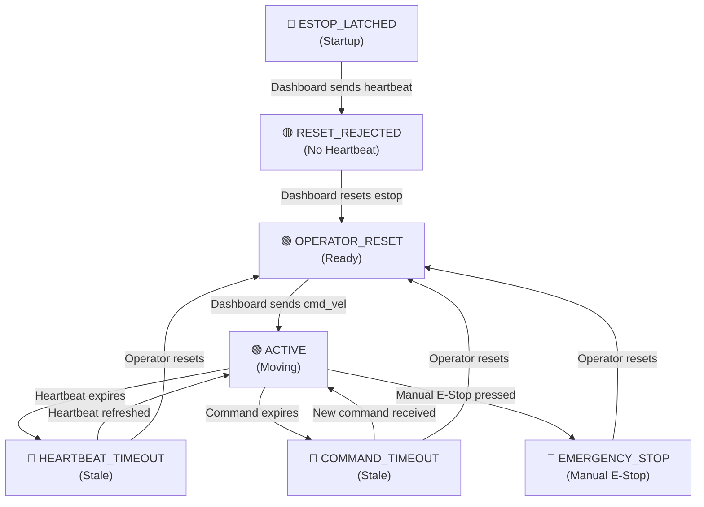

# Robot Dashboard Operational Runbook

**Last Updated:** 2026-08-29  
**System Version:** 1.0 (Production)  
**Project Status:** Fully Operational

---

## Table of Contents

1. [Pre-Flight Checklist](#pre-flight-checklist)
2. [Startup Sequence](#startup-sequence)
3. [Live Teleoperation](#live-teleoperation)
4. [Safety State Machine](#safety-state-machine)
5. [Emergency Recovery](#emergency-recovery)
6. [Troubleshooting Guide](#troubleshooting-guide)
7. [Performance Monitoring](#performance-monitoring)

---

## Pre-Flight Checklist

Before launching the robot dashboard system, verify:

- [ ] **System Clock Synchronized**: `timedatectl status` shows synchronized
- [ ] **ROS 2 Environment**: `echo $ROS_DISTRO` returns `jazzy`
- [ ] **Workspace Built**: No build errors in `ros2_ws`
  ```bash
  cd ~/robot-dashboard/ros2_ws
  colcon build --packages-select demo_pipeline safety_gateway adaptive_grid
  ```
- [ ] **Node Packages Installed**: All packages discoverable
  ```bash
  ros2 pkg list | grep -E 'demo_pipeline|safety_gateway|adaptive_grid|rosbridge'
  ```
- [ ] **Ports Available**:
  - Port 9090 free (rosbridge WebSocket) → `lsof -i :9090`
  - Port 5173 free (Vite dev server, if developing) → `lsof -i :5173`
- [ ] **Dashboard Built**: `npm run build` completed successfully in project root

---

## Startup Sequence

### Step 1: Clean Environment

Kill any stale ROS processes from previous runs:

```bash
pkill -f 'ros2 launch|synthetic_lidar|ground_filter|safety_gateway|adaptive_grid|rosbridge_websocket' || true
sleep 1
```

### Step 2: Source ROS Environment

From workspace root (`/home/subham/robot-dashboard`):

```bash
source /opt/ros/jazzy/setup.bash
source ros2_ws/install/setup.bash
```

### Step 3: Launch All Nodes

Start the full system with a single command:

```bash
cd ros2_ws
ros2 launch robot_bringup master.launch.py
```

**Expected Output:**

```
[INFO] [synthetic_lidar-1]: 1693401652.123456 [INFO] [rclpy]: Starting synthetic_lidar node
[INFO] [ground_filter-2]: 1693401652.234567 [INFO] [rclpy]: Initializing ground filter
[INFO] [safety_gateway-3]: 1693401652.345678 [INFO] [rclpy]: Safety gateway started latched
[INFO] [adaptive_grid-4]: 1693401652.456789 [INFO] [rclpy]: Adaptive grid node initialized
[INFO] [rosbridge_websocket-5]: 2026-08-29 12:34:56+0000 [-] Listening on port 9090
```

### Step 4: Verify Topic Publishing (60 second timeout)

In a new terminal, verify all topics are live:

```bash
source /opt/ros/jazzy/setup.bash
source ~/robot-dashboard/ros2_ws/install/setup.bash

# Wait up to 60 seconds for topics to appear
for i in $(seq 1 60); do
  if ros2 topic list 2>/dev/null | grep -q "/safety_gateway/status"; then
    echo "✓ Topics detected"
    ros2 topic list | grep -E '/lidar/points|/filtered_points|/adaptive_grid|/odom|/safety_gateway'
    break
  fi
  sleep 1
done
```

**Expected Topics:**

| Topic | Type | Source | Purpose |
|-------|------|--------|---------|
| `/lidar/points` | PointCloud2 | synthetic_lidar | Raw sensor data (synthetic) |
| `/filtered_points` | PointCloud2 | ground_filter | Filtered LiDAR points |
| `/adaptive_grid/occupancy` | OccupancyGrid | adaptive_grid | 2.5D occupancy map |
| `/adaptive_grid/elevation_markers` | MarkerArray | adaptive_grid | Height visualization markers |
| `/odom` | Odometry | synthetic_lidar | Pose and velocity feedback |
| `/safety_gateway/status` | String (JSON) | safety_gateway | Safety state |
| `/cmd_vel` | Twist | safety_gateway | Clamped motion commands |

### Step 5: Start Dashboard

In another terminal:

```bash
cd ~/robot-dashboard
npm run dev
```

The dashboard will be available at `http://localhost:5173` (or the URL shown in terminal).

---

## Live Teleoperation

### Required Safety Flow

The safety gateway enforces a **strict initialization sequence**. Commands are **rejected until**:

1. **Heartbeat is active** (dashboard sends heartbeat within 500 ms)
2. **Emergency stop is reset** (dashboard sends `emergency_stop = false`)
3. **Commands are continuous** (new command every 250 ms)

### Operator Workflow

1. **Open Dashboard** → Browser at `http://localhost:5173`
2. **Observe Status** → Will show **"ROS 2 OFFLINE"** initially
3. **Press Reset Button** → Dashboard sends heartbeat + reset signal
4. **Observe Status** → Changes to **"Ready for Commands"**
5. **Use Gamepad/Keyboard** → Sends `/dashboard/cmd_vel` commands
6. **Monitor Telemetry** → Dashboard displays:
   - ACTUAL LINEAR: m/s (from `/odom`)
   - ACTUAL ANGULAR: rad/s (from `/odom`)
   - Safety Status: Current mode (Active, Timeout, Estop, etc.)

### Manual Command Testing (CLI)

To test the system without the dashboard GUI:

```bash
source /opt/ros/jazzy/setup.bash
source ~/robot-dashboard/ros2_ws/install/setup.bash

# 1. Send heartbeat (initiates connection)
ros2 topic pub --once /dashboard/heartbeat std_msgs/msg/Empty "{}"

# 2. Reset emergency stop
ros2 topic pub --once /dashboard/emergency_stop std_msgs/msg/Bool "{data: false}"

# 3. Send motion command
ros2 topic pub --once /dashboard/cmd_vel geometry_msgs/msg/Twist \
  "{linear: {x: 0.5, y: 0.0, z: 0.0}, angular: {x: 0.0, y: 0.0, z: 0.3}}"

# 4. Verify outputs
ros2 topic echo --once /cmd_vel
ros2 topic echo --once /odom
ros2 topic echo --once /safety_gateway/status
```

---

## Safety State Machine

### State Diagram



### State Descriptions

| State | Duration | Velocity Output | Recovery |
|-------|----------|---|---|
| **ESTOP_LATCHED** | System startup | `0 m/s, 0 rad/s` | Send heartbeat |
| **RESET_REJECTED_NO_HEARTBEAT** | Until heartbeat arrives | `0 m/s, 0 rad/s` | Dashboard sends heartbeat |
| **OPERATOR_RESET** | Until first command | `0 m/s, 0 rad/s` | Send motion command |
| **ACTIVE** | While heartbeat + command valid | Clamped linear/angular | Continuous (no action needed) |
| **HEARTBEAT_TIMEOUT** | When heartbeat stale (>500 ms) | `0 m/s, 0 rad/s` | Dashboard sends heartbeat |
| **COMMAND_TIMEOUT** | When command stale (>250 ms) | `0 m/s, 0 rad/s` | Dashboard sends new command |
| **EMERGENCY_STOP** | When E-stop button pressed | `0 m/s, 0 rad/s` | Dashboard resets E-stop |

### Velocity Clamping

All commanded velocities are clamped to safe limits:

- **Max Linear Velocity**: 1.0 m/s (forward/backward)
- **Max Angular Velocity**: 1.5 rad/s (rotation)

```
clamped_linear = max(-1.0, min(1.0, requested.linear.x))
clamped_angular = max(-1.5, min(1.5, requested.angular.z))
```

---

## Emergency Recovery

### Scenario 1: Unresponsive Robot (Motion Not Stopping)

**Condition**: Robot continues moving despite released controls

**Recovery**:

1. **Hit E-Stop Button on Dashboard** → Sets `emergency_stop = true`
2. **Verify Status** → Should show `"EMERGENCY_STOP"` within 50 ms
3. **Check `/cmd_vel`** → Should be `linear.x: 0, angular.z: 0`
4. **When Safe**: Press Reset → `emergency_stop = false`

**If No Dashboard Access**:

```bash
# Manual E-Stop via CLI
source /opt/ros/jazzy/setup.bash
source ~/robot-dashboard/ros2_ws/install/setup.bash
ros2 topic pub --once /dashboard/emergency_stop std_msgs/msg/Bool "{data: true}"

# Verify motion stopped
sleep 0.1
ros2 topic echo --once /cmd_vel
```

### Scenario 2: Heartbeat Stale (Status Timeout)

**Condition**: System shows `"HEARTBEAT_TIMEOUT"` after 500 ms of inactivity

**Recovery**:

1. **Dashboard Auto-Recovery**: Re-engages heartbeat automatically when user resumes control
2. **Manual Recovery**:
   ```bash
   ros2 topic pub --once /dashboard/heartbeat std_msgs/msg/Empty "{}"
   ```
3. **System Returns to Ready**: After heartbeat resets, resume commands normally

### Scenario 3: Port 9090 Conflict (Rosbridge Unreachable)

**Condition**: Rosbridge fails to start; dashboard shows "Cannot Connect"

**Recovery**:

```bash
# Check what's using port 9090
lsof -i :9090

# Kill stale process
pkill -f rosbridge_websocket

# Clean all stale ROS processes
pkill -f 'ros2 launch|synthetic_lidar|ground_filter|safety_gateway|adaptive_grid' || true

# Restart from Step 1 of Startup Sequence
```

### Scenario 4: Node Crash

**Condition**: One node exits unexpectedly; system becomes incomplete

**Recovery**:

1. **Check Logs**:
   ```bash
   ros2 launch robot_bringup master.launch.py 2>&1 | head -50
   ```

2. **Kill All Nodes**:
   ```bash
   pkill -f 'ros2 launch|synthetic_lidar|ground_filter|safety_gateway|adaptive_grid|rosbridge' || true
   ```

3. **Rebuild Package** (if code was modified):
   ```bash
   cd ~/robot-dashboard/ros2_ws
   colcon build --packages-select <package_name> --event-handlers console_direct+
   ```

4. **Relaunch**:
   ```bash
   ros2 launch robot_bringup master.launch.py
   ```

---

## Troubleshooting Guide

### Issue: Dashboard Shows "ROS 2 OFFLINE"

**Symptoms**: Browser dashboard connected but no ROS data arriving

**Diagnosis**:

```bash
# Verify rosbridge is running
ps aux | grep rosbridge_websocket

# Check if topics are live
ros2 topic list | grep safety_gateway

# Check WebSocket connectivity
curl -i http://localhost:9090
```

**Solutions**:

1. **Restart Rosbridge Only**:
   ```bash
   pkill -f rosbridge_websocket
   cd ~/robot-dashboard/ros2_ws
   ros2 launch robot_bringup master.launch.py &
   sleep 3
   ```

2. **Verify Browser Connection**:
   - Clear browser cache: `Ctrl+Shift+Delete`
   - Reload page: `Ctrl+F5` (hard refresh)
   - Check browser console: `F12` → Console tab for WebSocket errors

3. **Check Firewall** (if remote):
   ```bash
   sudo ufw allow 9090/tcp
   ```

### Issue: Commands Not Executing (Always 0 m/s)

**Symptoms**: Dashboard sends commands but robot doesn't move

**Diagnosis**:

```bash
# Check safety status
ros2 topic echo --once /safety_gateway/status

# Inspect /cmd_vel being published
ros2 topic echo --once /cmd_vel

# Verify dashboard is sending /dashboard/cmd_vel
ros2 topic echo /dashboard/cmd_vel --once
```

**Solutions**:

1. **Missing Heartbeat Reset**:
   - Press Reset button on dashboard
   - Or manually: `ros2 topic pub --once /dashboard/heartbeat std_msgs/msg/Empty "{}"`

2. **Stale Heartbeat** (older than 500 ms):
   - Dashboard should auto-refresh
   - Check dashboard logs in browser console

3. **Command Timeout** (no new command in 250 ms):
   - Gamepad may have disconnected
   - Press any button to re-engage

### Issue: High Latency / Jerky Motion

**Symptoms**: Significant delay between control input and robot motion

**Diagnosis**:

```bash
# Check network latency (if remote)
ping -c 4 <robot_ip>

# Monitor ROS callback frequency
ros2 topic hz /cmd_vel
ros2 topic hz /odom
```

**Solutions**:

1. **Network Issues**:
   - Use 5 GHz WiFi instead of 2.4 GHz
   - Reduce distance to WiFi router
   - Use wired connection if available

2. **High System Load**:
   ```bash
   top -b -n 1 | head -20
   ```
   - Close unnecessary applications
   - Check adaptive_grid for excessive CPU: `ps aux | grep adaptive_grid`

3. **Dashboard Performance**:
   - Check browser tab: `F12` → Performance tab
   - Reduce point cloud rendering resolution (if available in dashboard)

### Issue: Adaptive Grid Not Updating

**Symptoms**: Occupancy/elevation markers frozen or missing

**Diagnosis**:

```bash
# Check if grid topics are publishing
ros2 topic hz /adaptive_grid/occupancy
ros2 topic hz /adaptive_grid/elevation_markers

# Inspect one message
ros2 topic echo --once /adaptive_grid/occupancy
```

**Solutions**:

1. **Restart Adaptive Grid Node**:
   ```bash
   pkill -f adaptive_grid
   # Wait for auto-restart via launch file, or relaunch master.launch.py
   ```

2. **Verify LiDAR Data**:
   ```bash
   ros2 topic echo --once /filtered_points
   ```
   - If empty, ground filter is not working

3. **Restart Ground Filter**:
   ```bash
   pkill -f ground_filter
   ```

### Issue: Stale ROS Process After Restart

**Symptoms**: Restart fails with "Address already in use" or stale node remains active

**Diagnosis**:

```bash
ps aux | grep ros2
ps aux | grep python3 | grep -E 'synthetic|safety|grid'
```

**Solutions**:

```bash
# Hard kill all ROS processes
pkill -9 -f 'ros2|synthetic_lidar|ground_filter|safety_gateway|adaptive_grid|rosbridge'

# Wait for cleanup
sleep 2

# Verify all are dead
ps aux | grep -i ros

# Restart normally
cd ~/robot-dashboard/ros2_ws
ros2 launch robot_bringup master.launch.py
```

---

## Performance Monitoring

### Recommended Monitoring Dashboard

Use these commands to observe system health in real-time:

```bash
#!/bin/bash
# Save as ~/robot-dashboard/monitor.sh
# Usage: bash monitor.sh

while true; do
  clear
  echo "=== Robot Dashboard System Monitor ==="
  echo "Time: $(date '+%Y-%m-%d %H:%M:%S')"
  echo ""
  
  echo "--- Active Nodes ---"
  ps aux | grep -E 'synthetic_lidar|ground_filter|safety_gateway|adaptive_grid|rosbridge' | grep -v grep | wc -l
  echo "nodes active"
  echo ""
  
  echo "--- Topic Publish Rates (Hz) ---"
  echo "LiDAR:       $(ros2 topic hz /lidar/points --window 5 2>/dev/null | tail -1 || echo 'N/A')"
  echo "Filtered:    $(ros2 topic hz /filtered_points --window 5 2>/dev/null | tail -1 || echo 'N/A')"
  echo "Grid:        $(ros2 topic hz /adaptive_grid/occupancy --window 5 2>/dev/null | tail -1 || echo 'N/A')"
  echo "Odometry:    $(ros2 topic hz /odom --window 5 2>/dev/null | tail -1 || echo 'N/A')"
  echo ""
  
  echo "--- System CPU/Memory ---"
  top -b -n 1 | grep "Cpu\|Mem" | head -2
  echo ""
  
  echo "--- Recent Safety Status ---"
  ros2 topic echo --once /safety_gateway/status 2>/dev/null | head -1 || echo "No data"
  echo ""
  
  sleep 5
done
```

Make it executable and run:

```bash
chmod +x ~/robot-dashboard/monitor.sh
bash ~/robot-dashboard/monitor.sh
```

### Key Health Metrics

| Metric | Healthy | Warning | Critical |
|--------|---------|---------|----------|
| Synthetic LiDAR Rate | 10 Hz | 5-10 Hz | <5 Hz |
| Ground Filter Rate | 10 Hz | 5-10 Hz | <5 Hz |
| Adaptive Grid Rate | 10 Hz | 5-10 Hz | <5 Hz |
| Odometry Rate | 20 Hz | 10-20 Hz | <10 Hz |
| Safety Status Rate | 20 Hz | 10-20 Hz | <10 Hz |
| Memory (ROS nodes) | <500 MB | 500-800 MB | >800 MB |
| CPU (ROS nodes) | <30% | 30-60% | >60% |

---

## Quick Command Reference

### Common Operations

```bash
# Source environment
source /opt/ros/jazzy/setup.bash
source ~/robot-dashboard/ros2_ws/install/setup.bash

# Launch system
cd ~/robot-dashboard/ros2_ws
ros2 launch robot_bringup master.launch.py

# Start dashboard (separate terminal)
cd ~/robot-dashboard
npm run dev

# Verify all topics
ros2 topic list | grep -E 'lidar|filtered|grid|odom|safety|cmd_vel'

# Test motion (heartbeat → reset → command)
ros2 topic pub --once /dashboard/heartbeat std_msgs/msg/Empty "{}"
ros2 topic pub --once /dashboard/emergency_stop std_msgs/msg/Bool "{data: false}"
ros2 topic pub --once /dashboard/cmd_vel geometry_msgs/msg/Twist \
  "{linear: {x: 0.8, y: 0.0, z: 0.0}, angular: {x: 0.0, y: 0.0, z: 0.6}}"

# Monitor specific topic
ros2 topic echo /adaptive_grid/occupancy

# Rebuild package
colcon build --packages-select demo_pipeline --event-handlers console_direct+

# Kill all ROS processes
pkill -f 'ros2 launch|synthetic_lidar|ground_filter|safety_gateway|adaptive_grid|rosbridge' || true
```

---

## Support & Escalation

### Getting Help

1. **Check this Runbook** → Most issues covered in Troubleshooting
2. **Review Logs** → `ros2 launch robot_bringup master.launch.py 2>&1 | tee /tmp/launch.log`
3. **Inspect Individual Nodes** → Launch each node separately with `output='screen'`
4. **Test CLI Commands** → Manually send heartbeat/reset/commands to isolate issue

### Filing a Bug Report

Include:

- System info: `lsb_release -a`, `uname -a`
- ROS version: `echo $ROS_DISTRO`
- Last 100 lines of launch output
- Browser console errors (F12)
- Steps to reproduce
- Expected vs. actual behavior

---

**End of Runbook**
